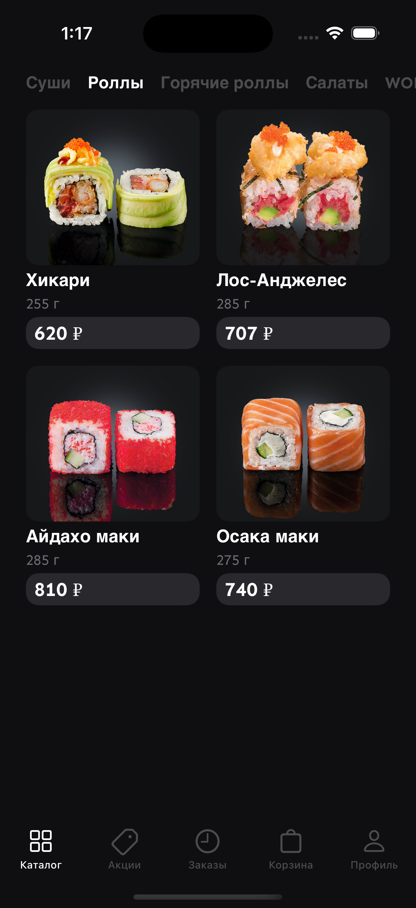
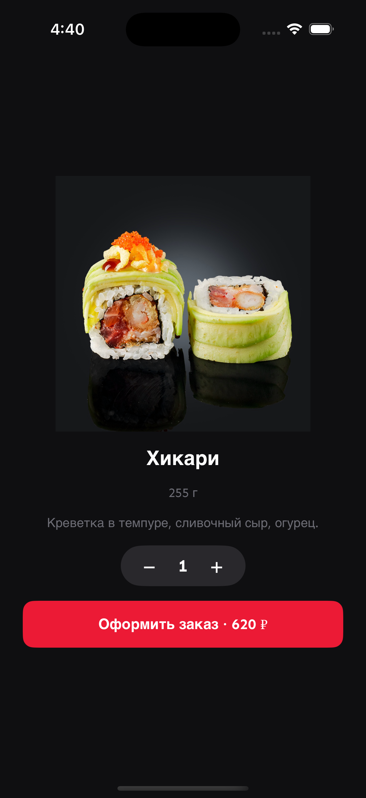
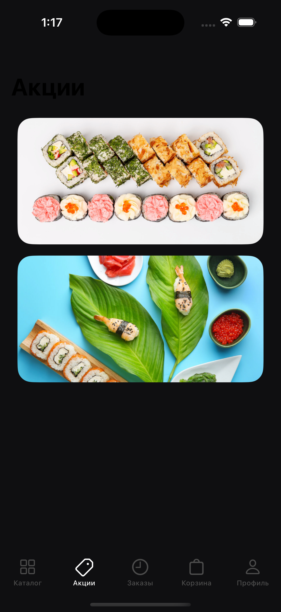
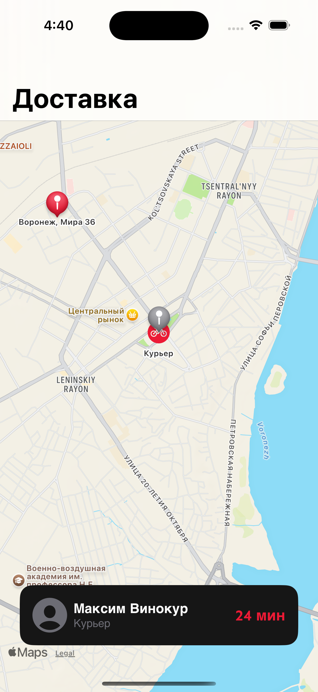

# Sushi Garden iOS

A Russian-language sushi delivery app built in Swift for iOS 17+, following the Figma design spec with full checkout → live-tracking → order history flow.

---

## Screenshots

| Register | Login | Catalog |
|----------|-------|---------|
|  |  |  |

| Product Detail | Promotions | Cart (filled) |
|----------------|------------|---------------|
|  |  |  |

| Cart (empty) | Checkout | Live Tracking |
|--------------|----------|---------------|
|  |  |  |

| Orders (empty) | Orders (filled) | Profile |
|----------------|-----------------|---------|
|  |  |  |

---

## Tech Stack

| Layer | Technology |
|-------|-----------|
| UI | SwiftUI (iOS 17) |
| Architecture | MVVM + `@MainActor` |
| Auth | Firebase Authentication (SPM) |
| Persistence | SwiftData (`ModelContainer`) |
| Maps | MapKit (iOS 17 `Map` API) |
| Project | XcodeGen (`project.yml`) |
| Tests | XCTest (unit) + XCUITest (UI) |

---

## Architecture

### Layer overview

```
┌─────────────────────────────────────────────┐
│                    App                       │
│   AppDelegate → SceneDelegate → UIWindow     │
│               ↓                              │
│        Dependencies (DI root)                │
│   auth │ menu │ cart │ orders │ isUITest     │
└──────────────────┬──────────────────────────┘
                   │ injected into every View
          ┌────────┴────────┐
          │   UIKit shell    │
          │ RootTabBarController (5 tabs)       │
          │  UIHostingController per tab        │
          └────────┬────────┘
                   │
          ┌────────┴────────────────────────┐
          │        SwiftUI Feature Views     │
          │                                  │
          │  CatalogView  ──→  ProductDetailView
          │  PromotionsView                  │
          │  CartView     ──→  CheckoutView ──→ TrackingView
          │  OrdersView                      │
          │  ProfileView                     │
          └──────────────────────────────────┘
```

### MVVM per feature

```
View  ──observes──▶  ViewModel (@MainActor ObservableObject)
                          │
                     Service layer
               ┌──────────┼──────────────┐
          AuthService  CartService   OrderStore
         (Firebase /   (@Published    (SwiftData
          FakeAuth)     items)        ModelContainer)
```

### Authentication flow

```
App launch
    │
    ├─ auth.currentUser != nil ──▶ RootTabBarController (main app)
    │
    └─ nil ──▶ AuthContainerView (bottom sheet)
                    │
                    ├─ Register mode: name + email + password
                    └─ Login mode:    email + password
                              │
                        Firebase Auth (prod)
                        FakeAuthService  (UI tests: -UITEST flag)
                              │
                        onAuthenticated(user) ──▶ main app
```

### Checkout → Tracking flow

```
CartView
    │  user taps "Оформить заказ"
    ▼
CheckoutView   (name / phone / email fields + fee summary)
    │  vm.confirm() →
    │    OrderStore.save(order)  ←─ SwiftData write
    │    cart.clear()
    │    didConfirm = true
    ▼
TrackingView
    │
    ├─ MapKit Map with Marker (restaurant), Marker (destination),
    │           Annotation (courier bicycle), MapPolyline
    └─ CourierSimulator (Timer, RunLoop.common)
            │  fires every 1 s
            └─ TrackingViewModel.objectWillChange forwarded
                    (nested ObservableObject workaround)
```

### Data persistence

```
OrderStore (SwiftData, @MainActor)
    ModelContainer
        └─ OrderEntity (@Model)
               id, createdAt, totalRub, linesJSON
               │
               JSON encode/decode ◀──▶ [OrderLine]
               (Codable value types)

CartService (in-memory, @MainActor)
    @Published var items: [CartItem]
    @Published var selectedAddOns: [AddOn]
    ─────────────────────────────────
    Combine assign(to: &$items) in CartViewModel
    (zero-retain-cycle subscription)
```

### Test strategy

```
Unit tests (57)                    UI tests (11)
───────────────────────────────    ────────────────────────────
CartServiceTests                   AuthUITests
CartViewModelTests                 CatalogUITests
CheckoutViewModelTests             CartUITests
OrderStoreTests                    CheckoutUITests
CourierSimulatorTests              TrackingUITests
FieldValidatorsTests               OrdersUITests
AuthViewModelTests

                    ↑                         ↑
              Real SwiftData           FakeAuthService
              inMemory: true           (-UITEST launch arg)
```

---

## Project Structure

```
SushiGarden/
├── App/
│   ├── AppDelegate.swift
│   ├── SceneDelegate.swift        ← routing hub, launch-arg flags
│   ├── Dependencies.swift         ← DI container
│   └── RootTabBarController.swift
├── Features/
│   ├── Auth/                      View + ViewModel
│   ├── Catalog/                   View + ViewModel
│   ├── ProductDetail/             View + ViewModel
│   ├── Cart/                      View + ViewModel
│   ├── Checkout/                  View + ViewModel
│   ├── Tracking/                  View + ViewModel
│   ├── Orders/                    View + ViewModel
│   ├── Promotions/                View
│   └── Profile/                   View
├── Services/
│   ├── Auth/       FirebaseAuthService, FakeAuthService
│   ├── Catalog/    MenuRepository, Product, AddOn
│   ├── Cart/       CartService, CartItem
│   ├── Orders/     OrderStore
│   ├── Delivery/   CourierSimulator, Courier, DeliveryAddress
│   └── Validation/ FieldValidators
├── SharedModels/   Order, OrderLine, OrderEntity, UserProfile
├── Resources/      Strings.swift, AppColor, AppFont, Spacing, A11y
└── Tests/          Unit + UI test targets
```

---

## Setup

### Prerequisites

- Xcode 16+, iOS 17 simulator
- [XcodeGen](https://github.com/yonaskolb/XcodeGen): `brew install xcodegen`

### Steps

```bash
git clone <repo>
cd sushi-garden-ios

# Add required files (not in repo):
#   SushiGarden/GoogleService-Info.plist   ← Firebase credentials
#   SushiGarden/Resources/Fonts/Mugesta.ttf ← licensed font

xcodegen generate          # regenerates SushiGarden.xcodeproj
open SushiGarden.xcodeproj
```

> **Without `GoogleService-Info.plist`** the app launches without crashing — `FirebaseAuthService` returns `nil` from `currentUser` so you land on the auth screen. Sign-in will fail. For development without Firebase, use the `-UITEST` launch argument (see below).

### Launch arguments (debug / screenshots)

| Argument | Effect |
|----------|--------|
| `-UITEST` | Replaces Firebase with `FakeAuthService` |
| `-SEEDED_AUTH` | Logs in as "Александр Новиков" on launch |
| `-AUTH_LOGIN` | Opens auth sheet in Login mode (default: Register) |
| `-START_TAB=N` | Opens tab N (0=Catalog…4=Profile) |
| `-SEEDED_CART` | Pre-fills cart with 2 products |
| `-SEEDED_ORDERS` | Pre-fills order history with 2 past orders |
| `-SHOW_DETAIL` | Opens first product's detail view directly |
| `-SHOW_CHECKOUT` | Opens checkout with 1 item in cart |
| `-SHOW_TRACKING` | Opens live-tracking view directly |

---

## Running Tests

```bash
# Unit tests
xcodebuild test \
  -project SushiGarden.xcodeproj \
  -scheme SushiGarden \
  -destination "platform=iOS Simulator,name=iPhone 16 Pro"

# UI tests only
xcodebuild test \
  -project SushiGarden.xcodeproj \
  -scheme SushiGardenUITests \
  -destination "platform=iOS Simulator,name=iPhone 16 Pro"
```

All 68 tests pass (57 unit + 11 UI).
